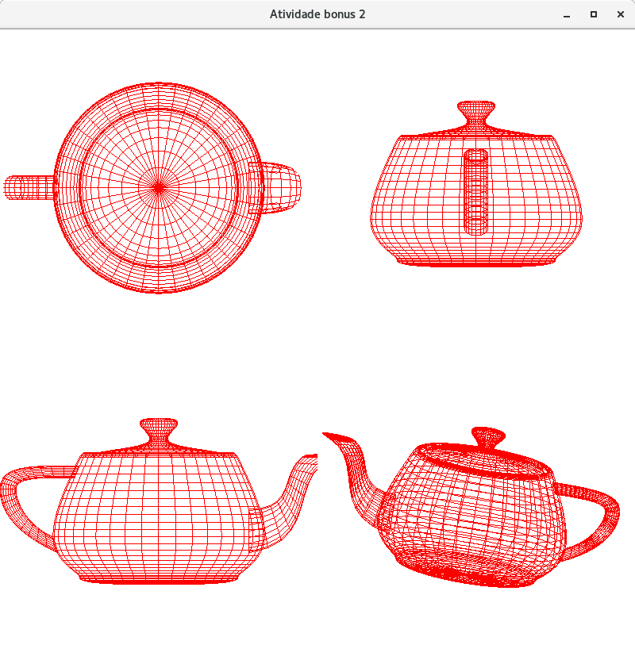

# bule-CG

### Dependências:

> freeglut

> freeglut-devel

> make

> gcc

### Compilando:

> gcc bonus2.c -o executavel -lGL -lglut -lGLU 

### Executando:

> ./executavel

Um bule centrado na origem em todas as viewports.

Viewport 1: Bule visto de cima

Viewport 2: Bule visto de frente

Viewport 3: Bule visto de lado

Viewport 4: Bule rotacionando
